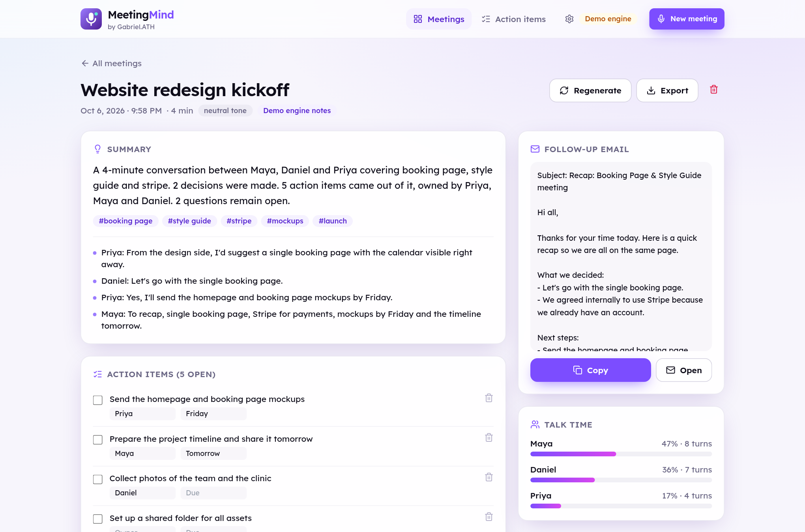
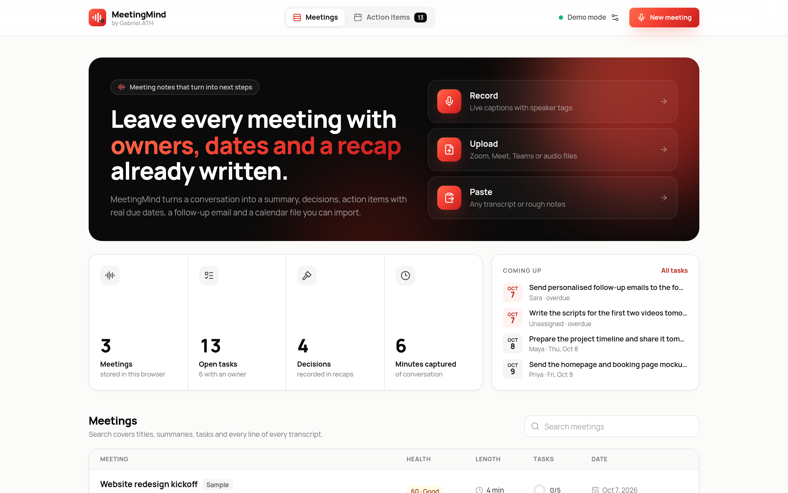
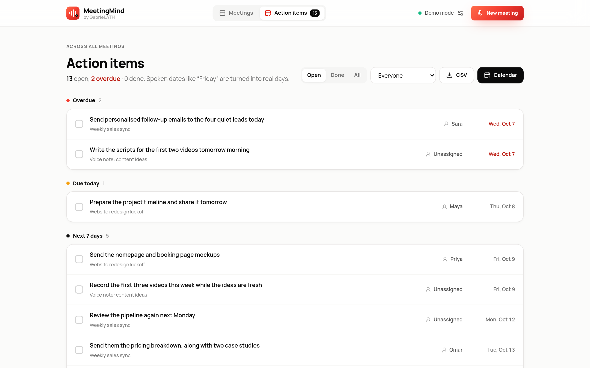
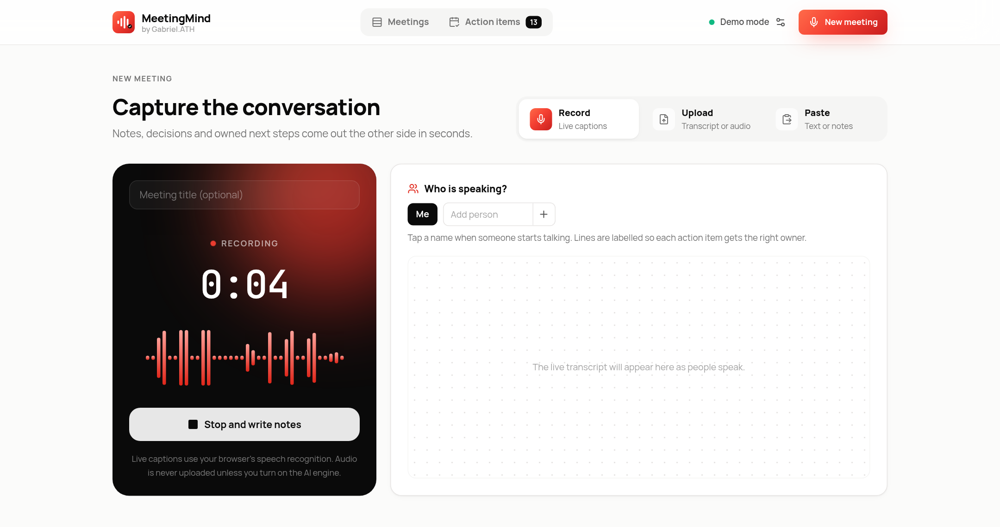
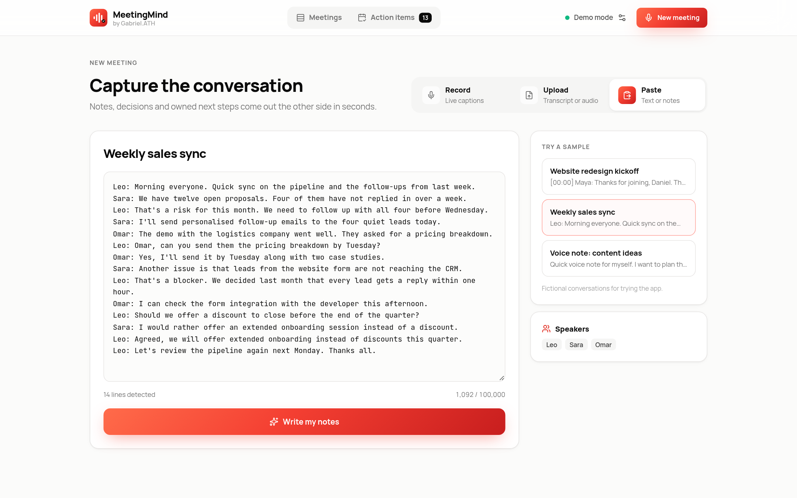
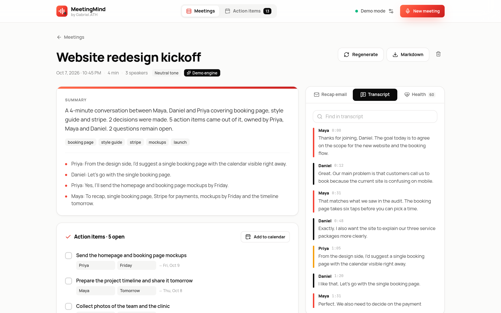
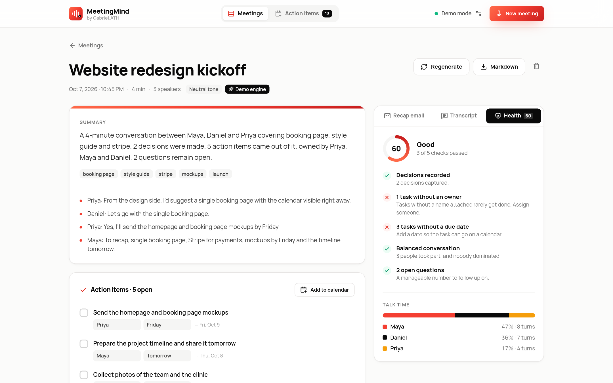
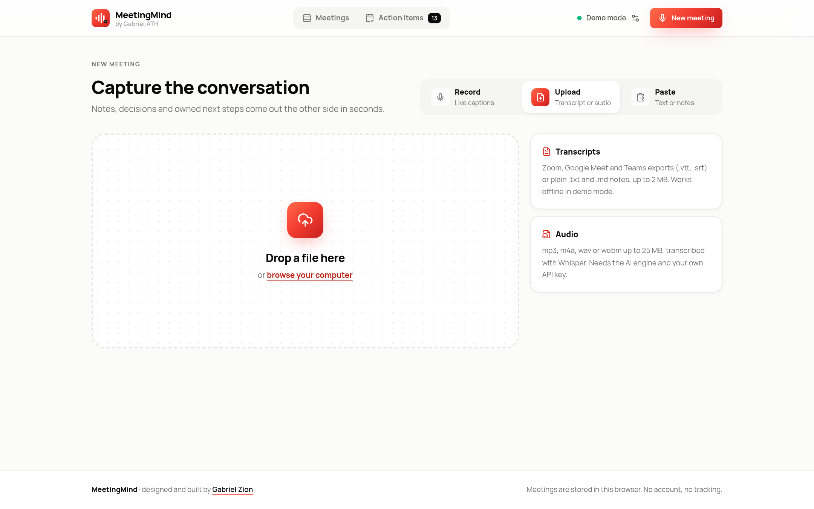
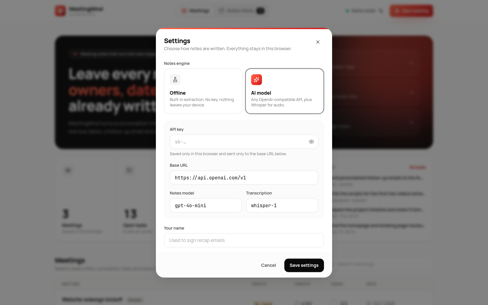

<div align="center">


# MeetingMind

### Meeting notes that turn into next steps.

Record a call, drop in a transcript or paste rough notes. MeetingMind writes the summary, pulls out decisions, assigns every task to a person with a real calendar date, scores how productive the meeting was and drafts the recap email.

No account, no server, no API key needed to try it.



</div>

---

## Why

The hard part of a meeting is what happens after it. Somebody has to write it up, figure out who said they would do what, translate “by Friday” into a date and chase people. MeetingMind is built around that moment: you leave with owners, dates and a recap already written.

## What it does

**Capture three ways**
- **Record** in the browser with live captions and a real-time microphone level meter. Tap a name when someone starts speaking so lines (and the tasks in them) are attributed to the right person.
- **Upload** Zoom, Meet or Teams exports (`.vtt`, `.srt`), plain `.txt`/`.md` notes, or audio files that are transcribed with Whisper when the AI engine is on.
- **Paste** any transcript. `Name: text` lines, `[00:12]` timestamps, WebVTT and SRT are detected automatically.

**Notes you can act on**
- Summary, key points, topics and overall tone.
- **Action items** with owner and due phrase. A request and its confirmation (“Priya, can you…” / “Yes, I’ll send them Friday”) become one task.
- **Real due dates.** “Tomorrow”, “Friday”, “next week”, “end of month” or “12 March” are resolved against the meeting date, never to a day in the past.
- **Add to calendar.** Export dated tasks as an `.ics` file (RFC 5545, all-day events) for Google Calendar, Outlook or Apple Calendar, from one meeting or from every meeting at once.
- **Decisions** and **open questions** listed separately.

**Meeting health**
- A score out of 100 built from five checks: were decisions made, does every task have an owner, does every task have a date, did one person dominate the conversation, and how many questions were left open.
- Talk-time split per speaker with share of words and number of turns.

**Follow through**
- Recap email with decisions, next steps and open questions, ready to copy or open in your mail app.
- **Action items** page grouped into Overdue, Due today, Next 7 days, Later and No date, with owner filter, CSV export and calendar export.
- Search across titles, summaries, tasks and every transcript line.
- Markdown export, regenerate with either engine, edit owners and dates inline.

## Screenshots

| Dashboard | Action items by due date |
|---|---|
|  |  |

| Live recording | Paste a transcript |
|---|---|
|  |  |

| Transcript with speakers | Meeting health |
|---|---|
|  |  |

| Upload | Settings |
|---|---|
|  |  |

## Two engines

| | Offline (default) | AI model |
|---|---|---|
| Key needed | No | Yours, kept in the browser |
| How | A TypeScript extraction pipeline: commitment and request patterns, due-date phrases, decision and question detection, sentence ranking | Any OpenAI-compatible chat API with a strict JSON contract, validated with Zod before it reaches the UI |
| Audio | Live captions via the browser’s speech recognition | Whisper transcription for recordings and uploads |
| Fallback | – | Falls back to the offline engine if the call fails |

## Privacy

- Meetings live in `localStorage`. There is no backend.
- The optional API key is stored only in your browser and sent only to the base URL you set. HTTPS is required except for `localhost`, so local models work too.
- Model output is schema-checked, size-limited and rendered as text, never HTML.

## Run locally

Requires Node.js 20.9 or newer.

```bash
git clone https://github.com/gabrielolarinre74-pixel/meetingmind-ai.git
cd meetingmind-ai
npm install
npm run dev          # http://localhost:3000
```

Three fictional sample meetings are loaded on first visit, so every screen has something to show. To use a real model, press `,` (or the settings icon), pick **AI model** and paste your key.

Production build (static files in `out/`):

```bash
npm run build
npm start            # serves out/ locally
```

Checks:

```bash
npm run lint         # TypeScript
npm test             # Vitest
```

`.env.example` lists the only build option (`BASE_PATH`). No secrets are needed.

## Tech stack

- Next.js 16 (App Router, static export), React 19, TypeScript
- Tailwind CSS with a custom red-gradient and warm-neutral design system, Manrope and JetBrains Mono
- Web Speech API, Web Audio `AnalyserNode` for the level meter, MediaRecorder
- Zod, lucide-react, react-hot-toast
- Vitest for parsers, extraction, due-date resolution, calendar export and health scoring
- GitHub Actions: type-check, tests and build on every push

## License

MIT. See [LICENSE](LICENSE).

---

Designed and built by **Gabriel Zion · Gabriel.ATH**. I build websites, apps and AI automation that help businesses grow. [Portfolio](https://gabrielzion-portfolio.vercel.app)
