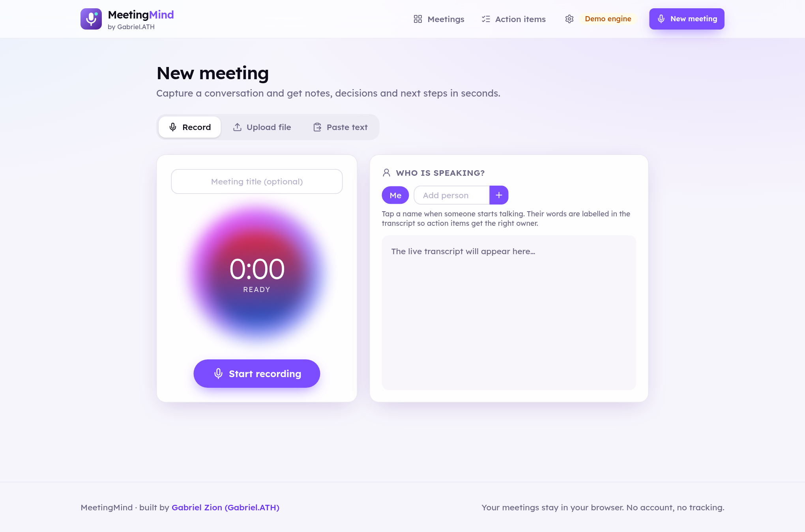

<div align="center">


# MeetingMind

**Turn any meeting, call or voice note into a summary, decisions, action items with owners and due dates, and a ready-to-send follow-up email.**

[**Live demo**](https://gabrielolarinre74-pixel.github.io/meetingmind-ai/) · works in the browser with sample meetings, no account and no API key


</div>

## The problem it solves

Teams lose hours after every meeting: someone has to write the notes, work out who promised what, and chase people by email. Things slip because the next steps were never written down.

MeetingMind does that part for you:

1. **Capture** the conversation: record it live in the browser, upload a Zoom / Google Meet / Teams transcript, upload audio, or paste notes.
2. **Understand** it: decisions, action items (with the person responsible and the deadline), open questions, key points, topics and the overall tone.
3. **Follow through**: copy the recap email, tick off tasks, and track every open action item across all your meetings in one list.

## Features

### Capture
- **Live recording with real-time captions** (Web Speech API in Chrome and Edge), with no upload and no key needed
- **Speaker tagging while you record**: tap a person's name when they start talking so their words, and their tasks, are attributed correctly
- **Audio transcription with Whisper** for recordings and uploaded files (mp3, m4a, wav, webm up to 25 MB) when the AI engine is on
- **Transcript import**: WebVTT and SRT (Zoom, Meet, Teams, YouTube), `Name: text` transcripts with or without `[00:12]` timestamps, and plain notes
- The microphone is always released when you stop recording or leave the page

### Understand
- **Action items** with owner and due date detection: "Priya, can you send the mockups by Friday?" becomes *Send the mockups · Priya · Friday*
- Requests and confirmations ("Yes, I'll send them by Friday") are **merged into one task**, and follow-ups like "I'll include it with the mockups" add detail to the right task
- **Decisions** ("let's go with…", "we agreed…") and **open questions** (real questions, not requests)
- Generated **title, summary, key points, topics** and **meeting tone** (positive / neutral / tense)
- **Talk-time analytics** per speaker (share of words and number of turns)

### Follow through
- **Recap email** with decisions, next steps (owner, due date) and open questions. Copy it or open it in your mail app
- **Action items board** across every meeting, with open/done filters, a per-person filter and **CSV export**
- Edit owners and due dates, add or remove tasks, and tick tasks off
- **Search** across titles, summaries, tasks and full transcripts, with matching snippets
- **Transcript view** with timestamps, speaker labels and find-in-transcript highlighting
- **Export a meeting to Markdown** for Notion, Google Docs or your wiki
- **Regenerate** notes at any time with either engine; completed tasks stay ticked

### Two engines
| Engine | Needs a key? | What it does |
|---|---|---|
| **Demo engine** (default) | No | A rule-based NLP pipeline written in TypeScript that runs offline in the browser. It finds commitments ("I'll…", "Name, can you…", "we need to…"), due-date phrases, decisions and questions, ranks key sentences and writes the recap. |
| **AI model** | Yes (yours) | Sends the transcript to any **OpenAI-compatible** chat model with a strict JSON contract. The response is **validated with Zod** before it reaches the UI. Uses Whisper for audio. If the AI call fails, the demo engine is used automatically. |

## Privacy and security

- **No backend and no account.** Meetings are stored in your browser's localStorage.
- Your API key (optional) is saved only in your browser and sent only to the API URL you configure. https is required, except for `localhost`, so it works with local models such as Ollama.
- Model output is treated as untrusted data: it is schema-validated, size-limited and rendered as text, never as HTML.
- Inputs are length-limited (transcripts, files, titles) and corrupted local data is ignored instead of crashing the app.

## Tech stack

- **Next.js 16** (App Router, static export) · **React 19** · **TypeScript**
- **Tailwind CSS** + `class-variance-authority` components · `lucide-react` icons · `react-hot-toast`
- **Zod** for validating AI responses
- **Vitest** unit tests for the transcript parsers, the analysis engine, due-date detection and the AI helpers
- **GitHub Actions**: test, build and deploy to GitHub Pages on every push

## Screenshots

| Dashboard | Action items |
|---|---|
|  |  |

| Record with speaker tagging | Paste or import a transcript |
|---|---|
|  |  |

## Run it locally

```bash
git clone https://github.com/gabrielolarinre74-pixel/meetingmind-ai.git
cd meetingmind-ai
npm install
npm run dev      # http://localhost:3000
npm test         # unit tests
npm run build    # static site in ./out
```

To use an AI model, click the **gear icon → AI model**, paste an API key and choose a model (default `gpt-4o-mini`, with `whisper-1` for transcription). Any OpenAI-compatible endpoint works.

## Project structure

```
app/
  page.tsx            dashboard: stats, search, meetings
  new/                record · upload · paste
  meeting/            notes, action items, email, talk time, transcript
  actions/            action items across all meetings
components/           Recorder, UploadPanel, PastePanel, SettingsDialog, UI
lib/
  transcript.ts       VTT / SRT / "Name: text" parsers, speaker stats
  analyze.ts          offline analysis engine (decisions, tasks, owners, dates…)
  ai.ts               OpenAI-compatible analysis + Whisper, Zod schema
  store.ts            localStorage store with useSyncExternalStore
  search.ts           ranked search across meetings
tests/                Vitest suites
```

## License

MIT. See [LICENSE](LICENSE).

---

Built by **Gabriel Zion · Gabriel.ATH**. I build websites, apps and AI automation that help businesses grow. [Portfolio](https://gabrielzion-portfolio.vercel.app)
